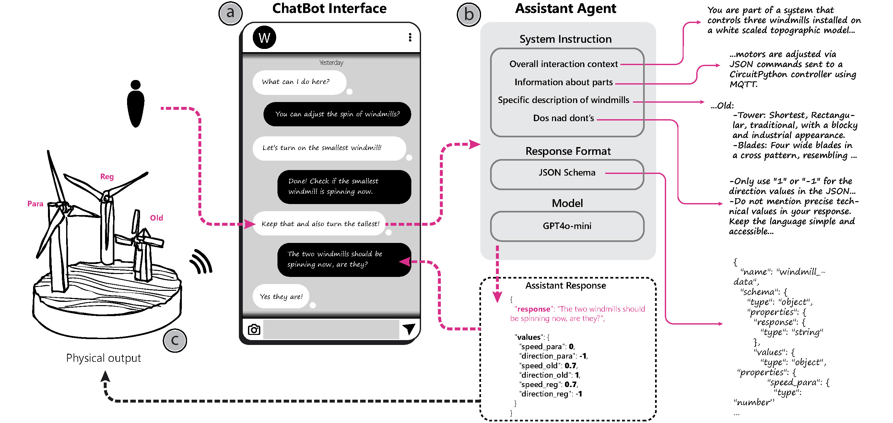

# Prompting Realities
**Exploring Prompting as an Interface for Tangible Artifacts**

Prompting Realities is a reusable pipeline that connects natural-language interaction to physical artifacts. It helps researchers, designers, and makers translate plain-language descriptions into structured outputs that real-world devices can act on.

This repository is both a companion to the CHItaly 2025 paper *Prompting Realities: Exploring the Potentials of Prompting for Tangible Artifacts* and a starting point for building your own LLM-driven tangible systems.

---

## How the System Flows

At a glance, each interaction moves from a conversation to an actuation loop:

```
User prompt
  |
  v
Large Language Model (LLM)
  |
  | produces JSON payload
  v
MQTT broker or local transport
  |
  v
Physical device (Arduino / ESP32 / other)
  |
  v
Tangible response
```

The LLM reads user requests using the guidance in `assistant_instructions.md`, responds with structured data defined by `assistant_response_schema.json`, and triggers behavior on connected hardware through MQTT or an equivalent transport.

---

## Repository Tour

- `core/`: Main implementation space.
  - `core/main/`: Default runtime used for the windmill prototype featured in the paper, including schemas, state files, and entry points for local experiments.
  - `core/TelegramBot-Integration/`: Telegram bot runtime that mirrors the core logic, adds bot wiring, and logs activity in a lightweight SQLite database.
  - `core/circuitpython/`: CircuitPython sketches and notes describing expected devices and MQTT payload handling.
- `examples/`: Reference projects that show how to adapt the assistant to different devices and scenarios.
  - `examples/RGBLED-assistant/`: End-to-end demo that couples the assistant with an Arduino RGB LED sketch, Python glue code, and firmware.
- `docs/assets/`: Shared visuals such as the architecture diagram.
- `.gitignore`: Patterns that keep transient files, logs, and local environments out of version control.

---

## Getting Started

1. **Install prerequisites**  
   You will need Python 3.9+ and an MQTT broker (local or hosted, such as [shiftr.io](https://shiftr.io/)). The examples assume `pip` is available.

2. **Clone the repository**
   ```bash
   git clone https://github.com/MahanMehrvarz/PromptingRealities.git
   cd PromptingRealities/core/main
   ```

3. **Create and activate a virtual environment**
   ```bash
   python3 -m venv venv
   source venv/bin/activate
   pip install openai paho-mqtt sounddevice webrtcvad python-dotenv
   cp .env.example .env
   ```
   Edit `.env` to add your OpenAI API key, MQTT broker credentials, and any custom parameters.

4. **Run the assistant**
   ```bash
   python Simple-assistant.py
   ```
   The CLI listens for natural-language input, produces JSON responses, and publishes them to the MQTT topic specified in `.env`.

5. **Wire up your hardware**  
   Match the device configuration described in `core/circuitpython/`. The firmware must parse the assistant's JSON and map it to the physical actuation you want.

---

## Customising the Pipeline

1. **Shape the interaction** - Update `assistant_instructions.md` with how your artifact behaves, what sensors or actuators it exposes, and how the assistant should respond to users.
2. **Define structured output** - Adjust `assistant_response_schema.json` so the assistant returns exactly the payload your device expects. Most recent LLMs support constrained JSON output, which keeps parsing reliable on the hardware side.
3. **Implement firmware** - Write or adapt microcontroller code that reads the JSON and performs the requested action.
4. **Align transport settings** - Configure MQTT topics and broker credentials (or your preferred transport) so the assistant and device share a common channel.
5. **Test and iterate** - Use the CLI `/help` command to see shortcuts for toggling text or voice input, clearing state, and restarting sessions while you refine prompts and responses.

The `examples/` directory is a good starting point when building for new hardware.

---

## Research Background

This repository accompanies:

**Mahan Mehrvarz, Dave Murray-Rust, and Himanshu Verma.**  
*Prompting Realities: Exploring the Potentials of Prompting for Tangible Artifacts.*  
In *CHItaly 2025: 16th Biannual Conference of the Italian SIGCHI Chapter*, Salerno, Italy.  
[https://doi.org/10.1145/3750069.3750089](https://doi.org/10.1145/3750069.3750089)

For a broader reflection on the project:

**Mahan Mehrvarz.**  
*Prompting Realities: Reappropriating Tangible Artifacts Through Conversation.*  
In *interactions*, Volume 32, Issue 4, July 2025, pages 10-11.  
[https://doi.org/10.1145/3742782](https://doi.org/10.1145/3742782)

Additional project links:

- Overview site: [https://mahanmehrvarz.name/promptingrealities/](https://mahanmehrvarz.name/promptingrealities/)
- 4TU Design United: [https://www.4tu.nl/du/projects/Prompting-Realities/](https://www.4tu.nl/du/projects/Prompting-Realities/)

---

## Architecture Overview



Refer to the CHItaly 2025 paper and the *interactions* article for a detailed explanation of each layer represented in the diagram.

---

## Next Steps

- Explore `core/main/` to understand the baseline runtime that powered the windmill prototype.
- Visit `core/TelegramBot-Integration/` if you plan to deploy via Telegram; this variant wraps the assistant with a SQLite log, supports multi-user chats, and handles voice messages.
- Start from `examples/RGBLED-assistant/` when adapting the pipeline to other hardware or interaction scenarios.
- **Upcoming change:** The current implementation targets the OpenAI Assistants API. A Conversations API version will be added when available.

---

## Acknowledgements


Prompting Realities was developed with the support of the [TU Delft StudioLab](https://studiolab.ide.tudelft.nl/) and the [AI Futures Lab](https://www.tudelft.nl/en/ide/research/research-labs/ai-futures-lab), whose communities and facilities helped shape the prototypes and research described here.

---

Maintained by [Mahan Mehrvarz](https://MahanMehrvarz.name) - AI Futures Lab, TU Delft.
