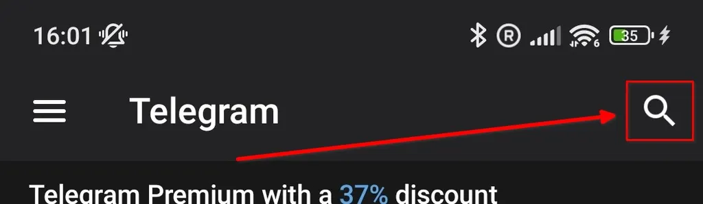
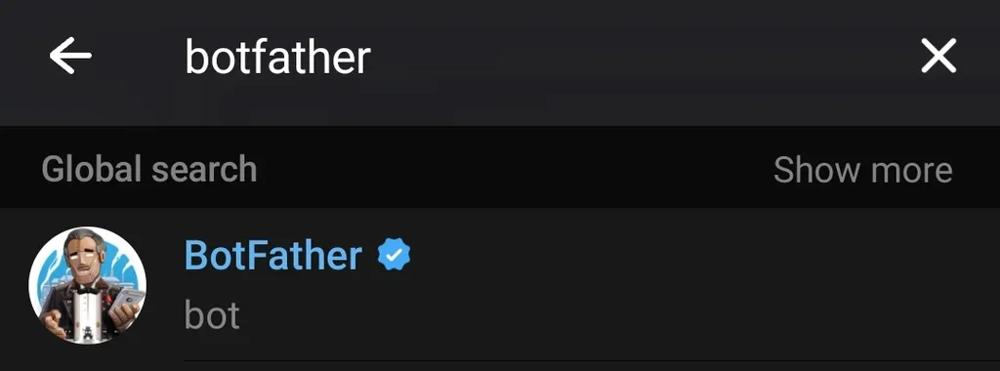
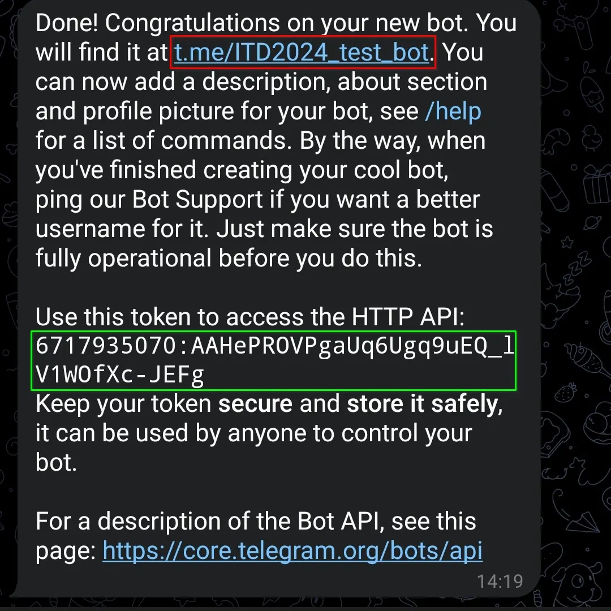

# Prompting Realities – Telegram Bot Runtime
This folder adapts the Prompting Realities pipeline (see the repository `README.md` and `core/main/README.md`) for Telegram. It wraps the existing assistant instructions and JSON schema in an `aiogram` bot that delivers the same MQTT payloads to your devices while logging every exchange for research use.

## Telegram Features
- Conversational control of the windmill prototype through Telegram text or voice messages.
- Inline consent workflow (`/consent`) with Yes/No buttons that records participants’ decisions.
- `/resetuser` command to spawn a fresh OpenAI thread and anonymized user ID for longitudinal studies.
- Whisper-powered voice transcription plus “blind” acknowledgements so users get an immediate reply before transcription completes.
- MQTT publisher with automatic reconnect and idle monitoring so commands continue flowing to the hardware.
- Local SQLite (`WM.db`) log that stores user/assistant messages, thread IDs, and per-message metadata.

## Prerequisites
- Python 3.10+
- A Telegram bot token created via [@BotFather](https://t.me/BotFather)
- MQTT broker reachable from the host machine (same topic and payload format used in `core/main`)
- Two OpenAI API keys:
  - Primary key: calls the Assistants API with your pre-configured assistant (`OPENAI_ASSISTANT_ID`)
  - Secondary key: issues quick “blind” acknowledgement replies while voice messages are transcribed

## Install Dependencies
Run these commands from the repository root or this directory:

```bash
python3 -m venv .venv
source .venv/bin/activate  # Windows: .venv\Scripts\activate
pip install aiogram==3.* aiosqlite aiohttp paho-mqtt openai python-dotenv
```

> The main README explains the broader architecture; this README focuses on Telegram-specific wiring.

## Configure Environment
Copy the sample file, then edit it with your own credentials. The file is gitignored so secrets stay local.

```bash
cp .env.example .env
```

Key variables:

| Variable | Purpose |
| --- | --- |
| `MQTT_BROKER`, `MQTT_TOPIC` | Broker host (wss/tcp) and topic; keep `wind` to match the default schema. |
| `MQTT_USER`, `MQTT_PASSWORD` | MQTT credentials (required for this runtime). |
| `MQTT_CLIENT_ID` | Optional identifier shown in broker dashboards (`WM_Sender` by default). |
| `DB_PATH` | SQLite file path (defaults to `WM.db`). |
| `TELEGRAM_BOT_TOKEN` | Token from BotFather. |
| `OPENAI_API_KEY_PRIMARY` | Key used by the Assistants API. |
| `OPENAI_ASSISTANT_ID` | ID of the assistant built from `core/main` instructions/schema. |
| `OPENAI_API_KEY_SECONDARY` | Key for lightweight chat completions (blind acknowledgements). |

To create or tweak the assistant prompt and JSON schema, follow the guidance in `core/main/README.md`. Once you update instructions or schema, obtain a fresh assistant ID and drop it here.

## Create a Telegram Bot Via BotFather
If you have never issued a Telegram bot token, follow these steps on your phone:

1. Install the Telegram app and open it. Tap the magnifying glass icon in the top right to open search.
2. Search for `BotFather` and confirm you’re opening the verified chat.
   
3. Open the verified BotFather conversation.
   
4. Send the command `/newbot` and follow the prompts to pick a public-facing name plus a unique username ending in `bot`.
5. BotFather replies with a summary that includes a deep link to your bot and the bot token. Copy the token into `TELEGRAM_BOT_TOKEN` in `.env` and keep it secret.
   

Open the provided link to start a conversation with your new bot so the integration can message you back.

## Run the Bot

```bash
python WMassistant.py
```

Startup sequence:
1. Loads `.env`, reads settings, and opens/initializes `WM.db`.
2. Ensures required tables/indexes exist via `OpenAiClientAssistant.init_db`.
3. Connects to the MQTT broker with retries, then schedules a background task that pings the connection.
4. Registers bot commands (`/start`, `/consent`, `/resetuser`) and begins polling Telegram.

## Interaction Flow
- **Text messages** are logged, forwarded to the OpenAI assistant, and generate both a human reply and MQTT payload.
- **Voice messages** trigger an instant “blind” reply, are downloaded/transcribed with Whisper, then follow the same assistant → MQTT pipeline as text.
- All messages (user and assistant) are stored in SQLite with anonymized `user_id`/`thread_id` pairs so you can analyze sessions later.

## Operational Notes
- The runtime reuses the same MQTT JSON contract as the CLI assistant. Familiarize yourself with the schema and windmill constraints in `core/main/README.md`.
- Deleting `WM.db` resets stored threads/conversations. Use `/resetuser` per participant to start fresh without dropping history.
- The bot currently relies on polling; for production you may swap in webhooks if desired.
- Keep both OpenAI keys scoped appropriately. The secondary key can have a tighter quota because it only generates short acknowledgements.
