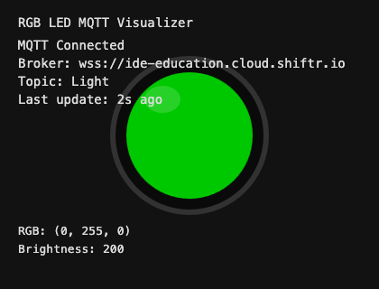

# RGB LED Assistant

An interactive Python assistant that listens for voice or text requests, asks OpenAI to translate them into LED colour presets, and pushes the result to an MQTT broker. A companion ESP32 sketch (tested on the [Seeed Studio XIAO ESP32S3](https://wiki.seeedstudio.com/xiao_esp32s3_getting_started/)) receives the MQTT payload and drives a NeoPixel RGB LED.

- Voice and text input modes with optional MQTT dry-run (`/dev`) preview.
- Automatic OpenAI Assistant provisioning based on `assistant_instructions.md` and `assistant_response_schema.json`.
- MQTT payloads in the format `{"led": [R, G, B, Brightness]}` for simple LED controllers.
- Ready-to-flash Arduino sketch for an ESP32-class microcontroller.

---

## Prerequisites

- Python 3.10+ with `pip`.
- An ESP32-based microcontroller (XIAO ESP32S3 recommended) wired to a 5 V NeoPixel LED on pin `D6`.
- Access to an MQTT broker (Shiftr, Mosquitto, or any MQTT service with TLS/credentials support).
- An OpenAI API key with access to the Assistants and transcription endpoints.
- Working microphone and speakers on the machine running the assistant.

---

## Installation

```bash
git clone <repo-url>
cd RGBLED-assistant
python -m venv .venv
source .venv/bin/activate  # Windows: .venv\Scripts\activate
pip install --upgrade pip
pip install openai paho-mqtt sounddevice webrtcvad
```

If you prefer to track dependencies, create your own `requirements.txt` once you confirm the versions that work in your environment.

---

## Configuration

All runtime settings come from environment variables. Create a `.env` file in the project root:

```bash
cp .env.example .env  # or create manually if the template is not present
```

Populate the file with your own values:

```ini
MQTT_BROKER=broker-hostname-or-ip
MQTT_PORT=1883
MQTT_TOPIC=Light
MQTT_CLIENT_ID=LED-sender
MQTT_USER=optional-username
MQTT_PASSWORD=optional-password

OPENAI_API_KEY=sk-...
OPENAI_ASSISTANT_MODEL=gpt-4o-mini
TRANSCRIPTION_MODEL=gpt-4o-transcribe
OPENAI_ASSISTANT_NAME=LED Assistant
OPENAI_ASSISTANT_DESCRIPTION=Controls LED presets via MQTT.
WELCOME_MESSAGE=Hello! Ask your question or use /help for commands.
```

- `MQTT_BROKER`, `MQTT_TOPIC`, and `OPENAI_API_KEY` are mandatory; the rest fall back to sensible defaults in `settings.py`.
- Credentials in `.env` take precedence over your shell environment. Keep this file out of version control.
- You can point `OPENAI_ASSISTANT_INSTRUCTIONS_FILE`, `OPENAI_ASSISTANT_SCHEMA_FILE`, and `OPENAI_ASSISTANT_STATE_FILE` to alternate files if you need multiple configurations.

### MQTT broker notes

- The assistant works with any standards-compliant MQTT broker. Configure `MQTT_USER`, `MQTT_PASSWORD`, and `MQTT_PORT` to match your service.
- For Shiftr.io, create a space, generate client credentials, and copy the broker URL, username, and password into the `.env` file. Add your own screenshots later if you want a visual walkthrough.
- If the broker enforces TLS, update the Arduino sketch accordingly (e.g., `WiFiClientSecure`).

---

## Test the flow with the P5.js simulator (optional)

Before you build the hardware, you can run a browser-based simulation that mirrors the assistant's MQTT payloads.

1. Open `p5-led-simulator/index.html` in your browser (serve it locally if your browser blocks file URLs).
2. Start the assistant with `python rgb_led_assistant.py`.
3. Trigger a few requests and watch the simulated LED reflect colour and brightness changes in real time.



---

## Flash the ESP32 firmware

The `rgb_led_arduino_demo.ino` sketch connects to WiFi, subscribes to the `MQTT_TOPIC`, and updates a NeoPixel with the payload received from the assistant.

1. Open the sketch in the Arduino IDE (ESP32 board support package installed).
2. Update the following constants near the top of the file:
   - `ssid` and `password` for your WiFi network.
   - `mqtt_broker`, `mqtt_user`, `mqtt_password`, `mqtt_topic`, and `client_id`.
   - `LED_PIN` if you wired the LED differently.
3. Select *Seeed XIAO ESP32S3* (or your board) and upload the sketch.
4. The sketch publishes an initial state `{"led":[0,255,0,200]}` and listens for updates.

---

## Running the assistant

```bash
source .venv/bin/activate
python rgb_led_assistant.py
```

- The assistant greets you (`WELCOME_MESSAGE`), calibrates the microphone, and attempts an MQTT connection.
- Type or speak your request (e.g., "Set the LED to soft orange at half brightness"). The assistant replies and publishes the corresponding RGB payload.
- If the MQTT connection fails, the assistant continues in local-only mode so you can still interact and preview payloads.

### Command shortcuts

- `/help` Show available commands.
- `/voice` Enable voice capture (default microphone, VAD-based).
- `/text` Return to text input mode.
- `/dev` Keep publishing but also print pretty JSON payloads (helpful for debugging).
- `/restart` Start a new OpenAI conversation thread.
- `/quit` Exit and close the MQTT connection.

---

## Expected behaviour

- Successful messages publish compact JSON to your MQTT topic, for example:

  ```json
  {"led":[255,128,64,180]}
  ```

  The four values map to `[Red, Green, Blue, Brightness]`, each in the range `0-255`.
- The Arduino sketch constrains brightness to `0-255`, sets NeoPixel intensity with `setBrightness`, and updates a single LED on each payload.
- If the OpenAI Assistant opts not to change the LED (because the user asked an unrelated question), the MQTT payload remains unchanged.

---

## Customising the OpenAI assistant

- Edit `assistant_instructions.md` to change how the model describes colours or when it is allowed to publish updates.
- Adjust `assistant_response_schema.json` if your firmware expects a different payload shape.
- The helper in `OpenAiClientAssistant.py` hashes both files and auto-creates/updates the remote Assistant when you run the app. The resulting assistant ID persists in `assistant_state.json`.

---

## Troubleshooting

- **No audio input detected**: confirm the correct microphone is selected in your OS; `sounddevice` always captures the default input.
- **MQTT publish skipped**: the console prints `Skipping MQTT publish; not connected.` Check broker credentials and network reachability.
- **`Missing required environment variable`**: either your `.env` file is missing a value or the key name does not match what `settings.py` expects.
- **Assistant responses feel off-topic**: regenerate `assistant_state.json` by deleting it and running the app (ensures the latest instructions/schema are uploaded).

---

## Next steps

- Update this README with photos of your hardware setup or screenshots of your Shiftr configuration.
- Consider adding a `CONTRIBUTING.md` with coding style and testing expectations if you plan to collaborate.
- For multi-LED strips, extend the JSON schema and Arduino sketch to handle arrays of pixels or animation commands.
